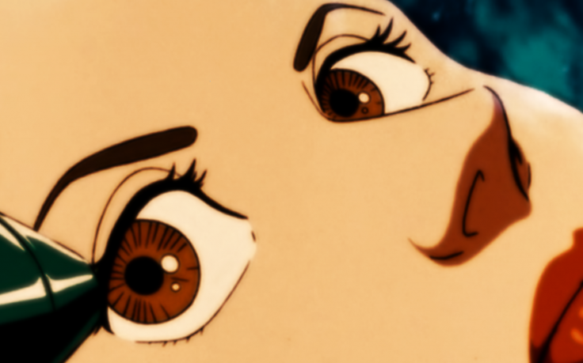

#Pixel Palatte.
A processing.py sketch that creates a pixilized image using the palatte specified.
It creates some interesting effects. Weirdly enough, I've found it works best with anime images.
Here are some examples:

##Screenshot:

Original:   

Greyscale palatte:   

Greyscale palatte (with image converted to greyscale):   

Colour palatte (using colors picked from the original image):   

Here's a sculpture:   

